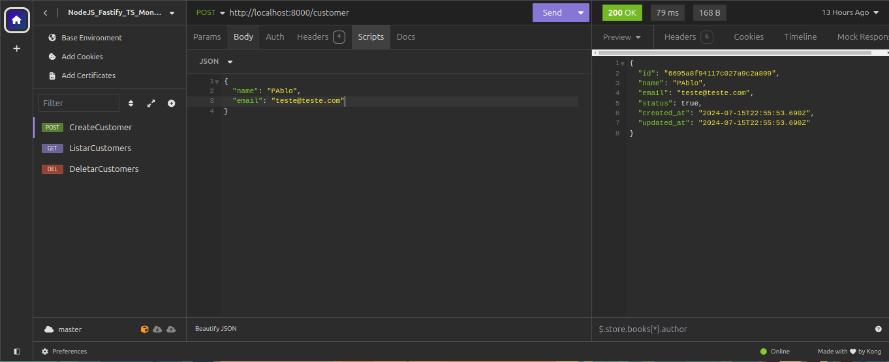

# API_Node.js_Fastify_TS_PrismaORM
API com Node.js, Fastify, TS e MongoDB e utilizamos Prisma ORM. API desenvolvida para cadastramento de de usuários com informações de nome, email e idade;

# Instalação:
Somente clonando o projeto; Verificando se possui na sua máquina o node na versão LTS ou a mais rescente. digitando comando 'npm install', pois as bibliotescas estarão inclusa no node_modules.

# Configuração:
Para que possamos ter acesso ao MongoDB(Será necessário ter um conhecimento prévio de mongoDB para configuração de acesso); Utilizaremos o PrismaORM para manipulações, processamentos, atualizações e exclusão de dados;

# USO:
Para iniciar o servidor, deixamos de forma rudimentar, somente digitando 'npm run dev', você receberá uma mensagem que a porta está no ar; Descrição das rotas disponíveis e seus respectivos métodos HTTP: 
GET: http://localhost:8000/customers, 
POST: http://localhost:8000/customer,  
DELETE: http://localhost:8000/customers/id

# Exemplos das Requisições HTTP:

Poderemos utilizar como ferramentas para nosso apoio o INSOMNIA e/ou POSTMAN.

# Modelos de dados:
Iremos passar no POSTMAN ou INSOMINIA, o campo nome, email (email tem uma regra onde ele é único) e idade;